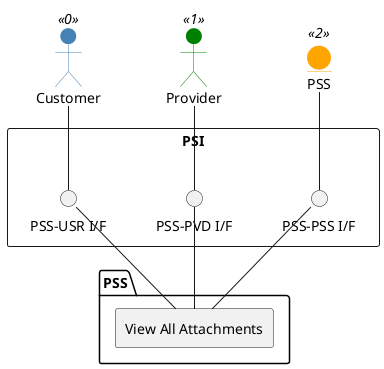

=begin

# TOD-01-03-10-View_All_Attachments

> The heading has to be included in the document including this document.

=end

{#fig:TOD-01-03-10-View_All_Attachments}

**Prerequisites**

Attachments exist in the PSS.

**Main operation**

Gets a list of all attachments that are applicable to the user requesting them.

**REST Endpoints**

@include [TOD-01-03-10 View All Attachments Endpoints](endpoints/TOD-01-03-10-View_All_Attachments-endpoints.md)

**Post Conditions**

The list of all available attachments is successfully returned.

**Applicable Requirements**

@include [TOD-01-03-10 View All Attachments Requirements](requirements/TOD-01-03-10-View_All_Attachments-requirements.md)

**eTOM Reference**

None
