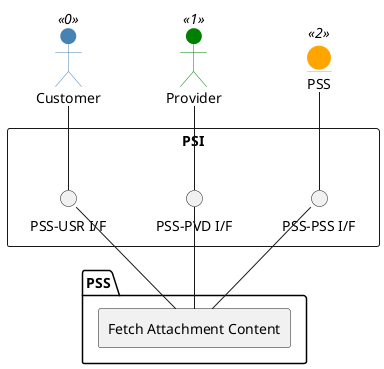

=begin

# TOD-01-03-11-Fetch_Attachment_Content

> The heading has to be included in the document including this document.

=end

{#fig:TOD-01-03-11-Fetch_Attachment_Content}

**Prerequisites**

The attachment whose binary content is to be fetched exists in the PSS.

**Main operation**

The operation fetches the actual binary content of the attachment from the PSS for direct preview.

**REST Endpoints**

@include [TOD-01-03-11 Fetch Attachment Content Endpoints](endpoints/TOD-01-03-11-Fetch_Attachment_Content-endpoints.md)

**Post Conditions**

The binary content of the attachment is successfully fetched for preview.

**Applicable Requirements**

@include [TOD-01-03-11 Fetch Attachment Content Requirements](requirements/TOD-01-03-11-Fetch_Attachment_Content-requirements.md)

**eTOM Reference**

None
