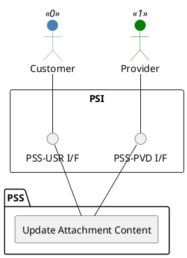

=begin

# TOD-01-03-12-Update_Attachment_Content

> The heading has to be included in the document including this document.

=end

{#fig:TOD-01-03-12-Update_Attachment_Content}

**Prerequisites**

The attachment whose binary content is to be updated exists in the PSS.

**Main operation**

This operation updates the actual binary content of an existing attachment in the PSS via a standard interface specification.
It means that the system implementing the interface updates the file in the physical location or file storage system.

**REST Endpoints**

@include [TOD-01-03-12 Update Attachment Content Endpoints](endpoints/TOD-01-03-12-Update_Attachment_Content-endpoints.md)

**Post Conditions**

The binary content of the attachment has been updated.

**Applicable Requirements**

@include [TOD-01-03-12 Update Attachment Content Requirements](requirements/TOD-01-03-12-Update_Attachment_Content-requirements.md)

**eTOM Reference**

None
