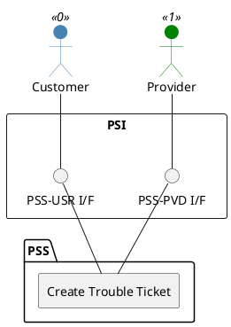

=begin

# TOD-01-04-01-Create_Trouble_Ticket

> The heading has to be included in the document including this document.

=end

{#fig:TOD-01-04-01-Create_Trouble_Ticket}

**Prerequisites**

The trouble ticket does not exist in the PSS datastore.

**Main operation**

Creates a new trouble ticket via a standard interface specification.

Some properties of a trouble ticket are:

* *name* - Short title for the trouble ticket
* *description* - Description of the trouble ticket, e.g. details about the incident.
* *priority* - The priority of the ticket. Can be set by the customer and changed later.
* *requestedResolutionDate* - Optional attribute to complement the priority.
* *ticketType* - Business type of the trouble ticket e.g. incident, complaint, request.
* *attachment* - File(s) attached to the trouble ticket. e.g. picture of broken device.
* *relatedEntity* - The entity against which the ticket is associated, e.g. a service instance.

**REST Endpoints**

@include [TOD-01-04-01 Create Trouble Ticket Endpoints](endpoints/TOD-01-04-01-Create_Trouble_Ticket-endpoints.md)

**Post Conditions**

The trouble ticket is successfully created in the PSS datastore.

**Applicable Requirements**

@include [TOD-01-04-01 Create Trouble Ticket Requirements](requirements/TOD-01-04-01-Create_Trouble_Ticket-requirements.md)

**eTOM Reference**

The operation is based on 1.4.6.1 process identifier from the eTOM.
