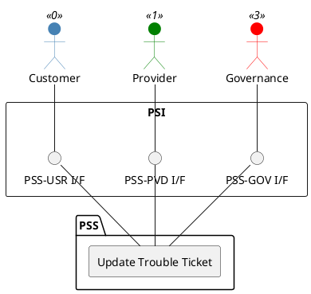

=begin

# TOD-01-04-02-Update_Trouble_Ticket

=end

{#fig:TOD-01-04-02-Update_Trouble_Ticket}

**Prerequisites**

The trouble ticket exists in the PSS datastore. The following properties are available additional to the creation:

* *expectedResolutionDate* - The expected resolution date by the provider.
* *resolutionDate* - The actual resolution date, set when closing the ticket.
* *status* - The current status of the ticket (e.g. pending, in progress, resolved).
* *statusChangeReason* - To be set when the status is changed. Will be stored in the status history by the server.
* *note* - Additional comments by the customer or provider.

**Main operation**

Updates an existing trouble ticket via a standard interface specification.

**REST Endpoints**

@include [TOD-01-04-02 Update Trouble Ticket Endpoints](endpoints/TOD-01-04-02-Update_Trouble_Ticket-endpoints.md)

**Post Conditions**

The trouble ticket is successfully updated in the PSS datastore.

**Applicable Requirements**

@include [TOD-01-04-02 Update Trouble Ticket Requirements](requirements/TOD-01-04-02-Update_Trouble_Ticket-requirements.md)

**eTOM Reference**

The operation is based on 1.4.6.4 and 1.4.6.6 process identifiers from the eTOM.
