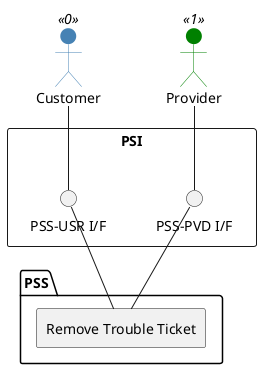

=begin

# TOD-01-04-03-Remove_Trouble_Ticket

=end

{#fig:TOD-01-04-03-Remove_Trouble_Ticket}

**Prerequisites**

The trouble ticket exists in the PSS datastore.

**Main operation**

Removes a trouble ticket either by deleting it or indicating it is no longer valid, via a standard interface specification.

**REST Endpoints**

@include [TOD-01-04-03 Remove Trouble Ticket Endpoints](endpoints/TOD-01-04-03-Remove_Trouble_Ticket-endpoints.md)

**Post Conditions**

The trouble ticket is successfully deleted or indicated it is no longer valid in the PSS datastore.

**Applicable Requirements**

@include [TOD-01-04-03 Remove Trouble Ticket Requirements](requirements/TOD-01-04-03-Remove_Trouble_Ticket-requirements.md)

**eTOM Reference**

The operation is based on 1.4.6.4 process identifier from the eTOM.
