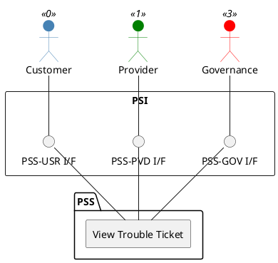

=begin

# TOD-01-04-04-View_Trouble_Ticket

> The heading has to be included in the document including this document.

=end

{#fig:TOD-01-04-04-View_Trouble_Ticket}

**Prerequisites**

The trouble ticket exists in the PSS datastore.

**Main operation**

Gets a trouble ticket with a specific identifier via a standard interface specification.

**REST Endpoints**

@include [TOD-01-04-04 View Trouble Ticket Endpoints](endpoints/TOD-01-04-04-View_Trouble_Ticket-endpoints.md)

**Post Conditions**

The trouble ticket is successfully returned to be viewed.

**Applicable Requirements**

@include [TOD-01-04-04 View Trouble Ticket Requirements](requirements/TOD-01-04-04-View_Trouble_Ticket-requirements.md)

**eTOM Reference**

The operation is based on 1.4.6.4 process identifier from the eTOM.
