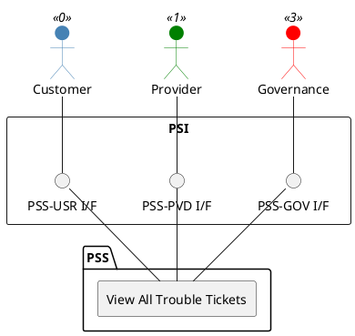

=begin

# TOD-01-04-05-View_All_Trouble_Tickets

> The heading has to be included in the document including this document.

=end

{#fig:TOD-01-04-05-View_All_Trouble_Tickets}

**Prerequisites**

Trouble Tickets exist in the PSS datastore.

**Main operation**

Gets all trouble tickets visible to the caller via a standard interface specification.
These can be filtered at least by type and status.

**REST Endpoints**

@include [TOD-01-04-05 View All Trouble Tickets Endpoints](endpoints/TOD-01-04-05-View_All_Trouble_Tickets-endpoints.md)

**Post Conditions**

All visible trouble tickets are successfully returned to be viewed.

**Applicable Requirements**

@include [TOD-01-04-05 View All Trouble Tickets Requirements](requirements/TOD-01-04-05-View_All_Trouble_Tickets-requirements.md)

**eTOM Reference**

The operation is based on 1.4.6.4 process identifier from the eTOM.
