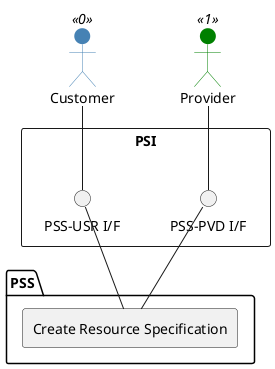

=begin

# TOD-02-01-01-Create_Resource_Specification

> The heading has to be included in the document including this document.

=end

{#fig:TOD-02-01-01-Create_Resource_Specification}

**Prerequisites**

The resource specification does not exist in the PSS datastore.

**Main operation**

Creates a new resource specification with its characteristics via a standard interface specification.

> Note: It is possible to create a resource specification which will be available in the future by setting the *validFor* property with a future time reference.

Some properties of a resource specification are:

* *name* - Short name of the target resource
* *description* - Description of the target resource
* *category* - Category (resource type) of the target resource like terminals, bandwidth, etc.
* *targetResourceSchema* - Name and reference to the JSON Schema defining the type of resource described by this specification.
* *resourceSpecCharacteristic* - List of characteristics i.e. technical specifications of the resource such as frequency band, Tx/Rx frequency, etc. Beam footprints are described as a characteristic of a *GeoJSON FeatureCollection* that contains one or more beam geometries in the GeoJSON data format (e.g. as a polygon) with corresponding properties, like the EIRP value.
* *relatedParty* - Usually reference to the provider that offers the resource
* *lifecycleStatus* - Current lifecycle status of the resource specification (e.g. active, draft, etc.)
* *validFor* - Time period of validity of the resource specification

Before creating a new resource specification, the provider or customer can request available resource templates from the PSS via the [TOD-04-01-05-View_All_Resource_Templates](#tod-04-01-05-viewallresourcetemplates) operation.
The templates are prepared by the governance of the PSS, and they contain default values for the characteristics of a resource specification.
For instance, if the provider wants to register a modem to the PSS, they can request available resource templates for modems.
Once they identify the target template for the resource specification they want to create, they need to replace the default values with specific ones and invoke the endpoint.

The templates are generic and therefore can be used by any provider.
This way, providers are given the flexibility to reuse from the template what is relevant for their resource specification, but also enhance it to fully match the characteristics of their resource.
This significantly shortens the time they require to prepare them for registration to the resource catalog of the PSS.

**REST Endpoints**

@include [TOD-02-01-01 Create Resource Specification Endpoints](endpoints/TOD-02-01-01-Create_Resource_Specification-endpoints.md)

**Post Conditions**

The resource specification is successfully created in the PSS datastore.

**Applicable Requirements**

@include [TOD-02-01-01 Create Resource Specification Requirements](requirements/TOD-02-01-01-Create_Resource_Specification-requirements.md)

**eTOM Reference**

The operation is based on 1.5.17.1 and 1.5.19.2 process identifiers from the eTOM.

