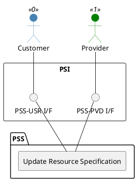

=begin

# TOD-02-01-02-Update_Resource_Specification

=end

{#fig:TOD-02-01-02-Update_Resource_Specification}

**Prerequisites**

The resource specification exists in the PSS datastore.

**Main operation**

Updates an existing resource specification via a standard interface specification.
A PSS might reject the update of essential characteristics like the frequency band.
In that case, the client shall set an expiration date for the current specification and create a new one that is valid thereafter.

**REST Endpoints**

@include [TOD-02-01-02 Update Resource Specification Endpoints](endpoints/TOD-02-01-02-Update_Resource_Specification-endpoints.md)

**Post Conditions**

The resource specification is successfully updated in the PSS datastore.

**Applicable Requirements**

@include [TOD-02-01-02 Update Resource Specification Requirements](requirements/TOD-02-01-02-Update_Resource_Specification-requirements.md)

**eTOM Reference**

The operation is based on 1.5.17.1 and 1.5.19.2 process identifiers from the eTOM.
