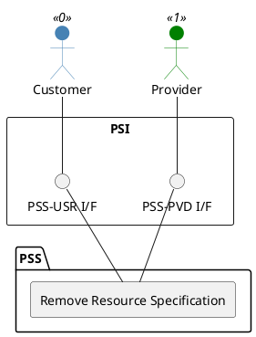

=begin

# TOD-02-01-03-Remove_Resource_Specification

=end

{#fig:TOD-02-01-03-Remove_Resource_Specification}

**Prerequisites**

The resource specification exists in the PSS datastore.

**Main operation**

Removes a resource specification either by deleting it or indicating it is no longer valid, via a standard interface specification.

**REST Endpoints**

@include [TOD-02-01-03 Remove Resource Specification Endpoints](endpoints/TOD-02-01-03-Remove_Resource_Specification-endpoints.md)

**Post Conditions**

The resource specification is successfully deleted or indicated it is no longer valid in the PSS datastore.

**Applicable Requirements**

@include [TOD-02-01-03 Remove Resource Specification Requirements](requirements/TOD-02-01-03-Remove_Resource_Specification-requirements.md)

**eTOM Reference**

The operation is based on 1.5.17.1 and 1.5.19.2 process identifiers from the eTOM.
