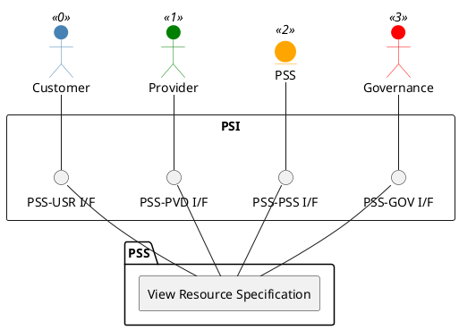

=begin

# TOD-02-01-04-View_Resource_Specification

> The heading has to be included in the document including this document.

=end

{#fig:TOD-02-01-04-View_Resource_Specification}

**Prerequisites**

The resource specification exists in the PSS datastore.

**Main operation**

Gets a resource specification of the provider with a specific identifier via a standard interface specification.
Customers can view their own declared resource specification.

**REST Endpoints**

@include [TOD-02-01-04 View Resource Specification Endpoints](endpoints/TOD-02-01-04-View_Resource_Specification-endpoints.md)

**Post Conditions**

The resource specification is successfully returned to be viewed.

**Applicable Requirements**

@include [TOD-02-01-04 View Resource Specification Requirements](requirements/TOD-02-01-04-View_Resource_Specification-requirements.md)

**eTOM Reference**

The operation is based on 1.5.17.1 and 1.5.19.2 process identifiers from the eTOM.
