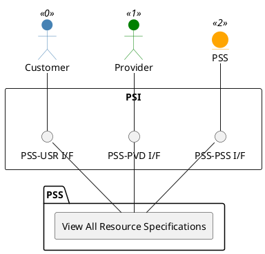

=begin

# TOD-02-01-05-View_All_Resource_Specifications

> The heading has to be included in the document including this document.

=end

{#fig:TOD-02-01-05-View_All_Resource_Specifications}

**Prerequisites**

Resource specifications of the provider exist in the PSS datastore.

**Main operation**

Gets all resource specifications of the provider via a standard interface specification.
These can be filtered at least by resource type.
Customers can view their own declared resource specifications.

**REST Endpoints**

@include [TOD-02-01-05 View All Resource Specifications Endpoints](endpoints/TOD-02-01-05-View_All_Resource_Specifications-endpoints.md)

**Post Conditions**

All resource specifications of the provider are successfully returned to be viewed.

**Applicable Requirements**

@include [TOD-02-01-05 View All Resource Specifications Requirements](requirements/TOD-02-01-05-View_All_Resource_Specifications-requirements.md)

**eTOM Reference**

The operation is based on 1.5.17.1 and 1.5.19.2 process identifiers from the eTOM.
