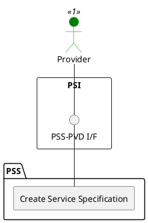

=begin

# TOD-02-02-01-Create_Service_Specification

> The heading has to be included in the document including this document.

=end

{#fig:TOD-02-02-01-Create_Service_Specification}

**Prerequisites**

The service specification does not exist in the PSS datastore.

**Main operation**

Creates a new service specification with its characteristics and references to resource specifications via a standard interface specification.

> Note: It is possible to create a service specification which will be available in the future by setting the *validFor* property with a future time reference.

Some properties of a service specification are:

* *name* - Short name of the target service
* *description* - Description of the target service
* *category* - Category (service type) of the target service like internet access, telephony, IP-Trunk, etc.
* *resourceSpecification* - List of resources that are required to realise the target service
* *targetEntitySchema* - Name and reference to the JSON Schema defining the type of service described by this specification.
* *specCharacteristic* - List of specification characteristics of the target service such as forwardCIR, returnCIR, etc.
  The footprint of a service is described as a characteristic of type *GeoJSON FeatureCollection*, which contains one or more GeoJSON entries (e.g. as a polygon) with the option for assigned properties, such as the EIRP value.
* *relatedParty* - Usually reference to the provider that offers the service
* *lifecycleStatus* - Current lifecycle status of the service specification (e.g. active, draft, etc.)
* *validFor* - Time period of validity of the service specification

Before creating a new service specification, a provider can request available service templates from the PSS via the [TOD-04-02-05-View_All_Service_Templates](#tod-04-02-05-viewallservicetemplates) operation.
The templates are prepared by the governance of the PSS, and they contain default values for the characteristics of a service specification.
For instance, if the provider wants to register a service specification for internet access to the PSS, they can request available service templates for internet access, replace the default values with specific ones and invoke the endpoint for creating a service specification.

The templates are generic and therefore can be used by any provider.
This way, providers are given the flexibility to reuse from the template what is relevant for their service specification, but also enhance it to fully match the characteristics of their service.
This shortens the time a provider requires for registration of their service specifications to the service catalog of the PSS while still allowing them to showcase their unique selling points.

**REST Endpoints**

@include [TOD-02-02-01 Create Service Specification Endpoints](endpoints/TOD-02-02-01-Create_Service_Specification-endpoints.md)

**Post Conditions**

The service specification is successfully created in the PSS datastore.

**Applicable Requirements**

@include [TOD-02-02-01 Create Service Specification Requirements](requirements/TOD-02-02-01-Create_Service_Specification-requirements.md)

**eTOM Reference**

The operation is based on 1.4.15.1 and 1.4.19.2 process identifiers from the eTOM.

