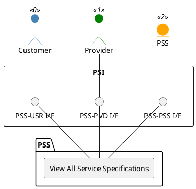

=begin

# TOD-02-02-05-View_All_Service_Specifications

> The heading has to be included in the document including this document.

=end

{#fig:TOD-02-02-05-View_All_Service_Specifications}

**Prerequisites**

Service specifications of the provider exist in the PSS datastore.

**Main operation**

Gets all service specifications of the provider via a standard interface specification.
These can be filtered at least by service type.

**REST Endpoints**

@include [TOD-02-02-05 View All Service Specifications Endpoints](endpoints/TOD-02-02-05-View_All_Service_Specifications-endpoints.md)

**Post Conditions**

All service specifications of the provider are successfully returned to be viewed.

**Applicable Requirements**

@include [TOD-02-02-05 View All Service Specifications Requirements](requirements/TOD-02-02-05-View_All_Service_Specifications-requirements.md)

**eTOM Reference**

The operation is based on 1.4.15.1 and 1.4.19.2 process identifiers from the eTOM.
