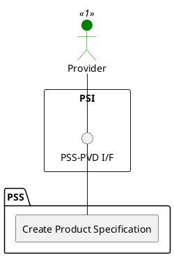

=begin

# TOD-02-03-01-Create_Product_Specification

> The heading has to be included in the document including this document.

=end

{#fig:TOD-02-03-01-Create_Product_Specification}

**Prerequisites**

The product specification does not exist in the PSS datastore.

**Main operation**

Creates a new product specification with its characteristics and references to resource/service specifications via a standard interface specification.

> Note: It is possible to create a product specification which will be available in the future by setting the *validFor* property with a future time reference.

Some properties of a product specification are:

* *name* - Short name of the target product
* *description* - Description of the target product
* *productNumber* - Identification number assigned to uniquely identify the specification
* *bundledProductSpecification* - If the product is a bundle of multiple products, a list of the related product specifications
* *resourceSpecification* - List of resources that are required to realise the target product
* *serviceSpecification* - List of services that are required to realise the target product
* *targetProductSchema* - Name and reference to the JSON Schema defining the type of product described by this specification.
* *productSpecCharacteristic* - List of distinctive features of the target product such as 'networkUptime', 'dataAllowance', etc.
* *relatedParty* - Usually reference to the provider that offers the product
* *lifecycleStatus* - Current lifecycle status of the product specification (e.g. active, draft, etc.)
* *validFor* - Time period of validity of the product specification

**REST Endpoints**

@include [TOD-02-03-01 Create Product Specification Endpoints](endpoints/TOD-02-03-01-Create_Product_Specification-endpoints.md)

**Post Conditions**

The product specification is successfully created in the PSS datastore.

**Applicable Requirements**

@include [TOD-02-03-01 Create Product Specification Requirements](requirements/TOD-02-03-01-Create_Product_Specification-requirements.md)

**eTOM Reference**

The operation is based on 1.2.22.1 and 1.2.23.2 process identifiers from the eTOM.

