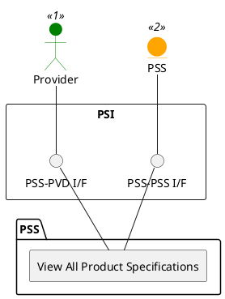

=begin

# TOD-02-03-05-View_All_Product_Specifications

> The heading has to be included in the document including this document.

=end

{#fig:TOD-02-03-05-View_All_Product_Specifications}

**Prerequisites**

Product specifications of the provider exist in the PSS datastore.

**Main operation**

Gets all product specifications of the provider via a standard interface specification.

**REST Endpoints**

@include [TOD-02-03-05 View All Product Specifications Endpoints](endpoints/TOD-02-03-05-View_All_Product_Specifications-endpoints.md)

**Post Conditions**

All product specifications of the provider are successfully returned to be viewed.

**Applicable Requirements**

@include [TOD-02-03-05 View All Product Specifications Requirements](requirements/TOD-02-03-05-View_All_Product_Specifications-requirements.md)

**eTOM Reference**

The operation is based on 1.2.22.1 and 1.2.23.2 process identifiers from the eTOM.
