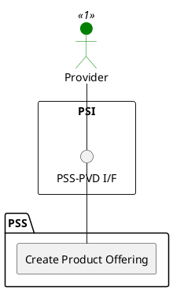

=begin

# TOD-02-04-01-Create_Product_Offering

> The heading has to be included in the document including this document.

=end

{#fig:TOD-02-04-01-Create_Product_Offering}

**Prerequisites**

The product offering does not exist in the PSS datastore.

**Main operation**

Creates a new product offering with product price, SLS, etc. via a standard interface specification.

> Note: It is possible to create a product offering which will be available in the future by setting the *validFor* property with a future time reference.

Some properties of a product offering are:

* *name* - Short name of the target offering
* *description* - Description of the target offering
* *productOfferingTerm* - Condition under which the offering is made available to customers, for example different commitment periods
* *productSpecification* - Reference to the product specification the target offering is about
* *serviceLevelSpecification* - SLS for the product offering
* *prodSpecCharValueUse* - Applied characteristics of the product specification, when there are variants
* *productOfferingPrice* - Price components for the offered product.
  Combinations of different types or multiple entries of the same type are possible.
  * "one-time" prices are related to a singular payment (e.g. for delivered hardware).
  * "recurring" prices are paid regularly (e.g. services or leased hardware).
    The interval can be defined by the sub-properties `recurringChargePeriod` (e.g. "month", "week" or "day") and `recurringChargePeriodLength` (defaults to 1).
  * "per-use" prices depend on the usage of a product.
    The sub-property `unitOfMeasure` defines the basis for calculations (e.g. "per Minute" or "per 100 MB").
    `recurringChargePeriod` and `recurringChargePeriodLength` are used to define the billing period.
* *accessProbability* - Probability that an order of this offering can be fulfilled
* *lifecycleStatus* - Current lifecycle status of the product offering (e.g. active, draft, etc.)
* *validFor* - Time period of validity of the product offering

**REST Endpoints**

@include [TOD-02-04-01 Create Product Offering Endpoints](endpoints/TOD-02-04-01-Create_Product_Offering-endpoints.md)

**Post Conditions**

The product offering is successfully created in the PSS datastore.

**Applicable Requirements**

@include [TOD-02-04-01 Create Product Offering Requirements](requirements/TOD-02-04-01-Create_Product_Offering-requirements.md)

**eTOM Reference**

The operation is based on 1.2.7.2.3 process identifier from the eTOM.
