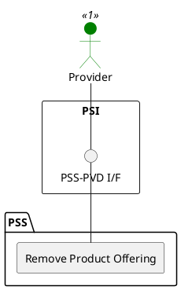

=begin

# TOD-02-04-03-Remove_Product_Offering

> The heading has to be included in the document including this document.

=end

{#fig:TOD-02-04-03-Remove_Product_Offering}

**Prerequisites**

The product offering exists in the PSS datastore.

**Main operation**

Removes a product offering either by deleting it or indicating it is no longer valid, via a standard interface specification.

**REST Endpoints**

@include [TOD-02-04-03 Remove Product Offering Endpoints](endpoints/TOD-02-04-03-Remove_Product_Offering-endpoints.md)

**Post Conditions**

The product offering is successfully deleted or indicated it is no longer valid in the PSS datastore.

**Applicable Requirements**

@include [TOD-02-04-03 Remove Product Offering Requirements](requirements/TOD-02-04-03-Remove_Product_Offering-requirements.md)

**eTOM Reference**

The operation is based on 1.2.7.2.3 process identifier from the eTOM.
