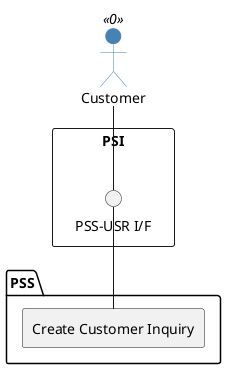

=begin

# TOD-03-01-01-Create_Customer_Inquiry

> The heading has to be included in the document including this document.

=end

{#fig:TOD-03-01-01-Create_Customer_Inquiry}

**Prerequisites**

None

**Main operation**

Creates a new customer inquiry via a standard interface specification.
The inquiry will be processed asynchronously, either via an algorithm or manually by a provider.
To do that, the PSS may forward the created inquiry to eligible providers via Event Management API, which is also used by them to propagate the update back.

The implementation must provide **at least** the maximum estimated response time to prevent long delays.
Optionally, it can also define a minimum and an average response time.
These values are either determined by the algorithm run time, the governance of the PSS that can set the response time of each provider in their party profiles, the customer's preference or a default PSS configuration.

Some properties of a customer inquiry are:

* *customerProfile* - Automatically filled with authenticated data from the customer profile by the PSS.
                      The set of characteristics has to be agreed between the involved systems a priori, which enables different levels of anonymization.
                      For example, the governances of both systems may decide to just exchange an anonymized indication of the kind of customer and their country code instead of their real name and address.
                      If the *priority* of a customer is included, there must be a common understanding of what the values mean or one system has to map these accordingly.
                      For example, a "high priority" customer of a commercial PSS may be less important than a customer with the same level denomination in a governmental system.
                      Note that the customer may be allowed to select a *lower* priority for their request, which shall then be indistinguishable from other low priority requests.
* *customerResources* - List of resource specifications, which are already owned by the customer and shall be used for the inquired service
* *inquiredProducts* - Specifications of products the customer needs.
                       These are built from characteristics with minimum, maximum and target values.
                       The customer can prioritize characteristics (e.g. "availability is more important than information rate").
                       The provider can use this information when they can not meet all target values and have to waive on some.
                       If this inquiry is an RFQ, the customer may specify a specification ID from the catalog to get an offering for that specific item.
* *providers* - A list of third parties to contact. If the list is empty, then the PSS will take into consideration the product offerings of all providers. This is typical for a matchmaking customer inquiry. For an RFQ, for example, the customer might specify a list of preferred providers from which they want to get an offer.

**REST Endpoints**

@include [TOD-03-01-01 Create Customer Inquiry Endpoints](endpoints/TOD-03-01-01-Create_Customer_Inquiry-endpoints.md)

**Post Conditions**

* The customer inquiry is successfully created in the PSS datastore.
* The processor of the inquiry is notified.

**Applicable Requirements**

@include [TOD-03-01-01 Create Customer Inquiry Requirements](requirements/TOD-03-01-01-Create_Customer_Inquiry-requirements.md)

**eTOM Reference**

The operation is based on 1.3.5.1 process identifiers from the eTOM.

