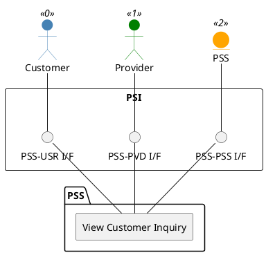

=begin

# TOD-03-01-02-View_Customer_Inquiry

> The heading has to be included in the document including this document.

=end

{#fig:TOD-03-01-02-View_Customer_Inquiry}

**Prerequisites**

The customer inquiry exists in the PSS datastore.

**Main operation**

Gets a customer inquiry of the customer with a specific identifier via a standard interface specification.

**REST Endpoints**

@include [TOD-03-01-02 View Customer Inquiry Endpoints](endpoints/TOD-03-01-02-View_Customer_Inquiry-endpoints.md)

**Post Conditions**

The customer inquiry is successfully returned to be viewed.

**Applicable Requirements**

@include [TOD-03-01-02 View Customer Inquiry Requirements](requirements/TOD-03-01-02-View_Customer_Inquiry-requirements.md)

**eTOM Reference**

The operation is based on 1.3.5.6 process identifiers from the eTOM.

