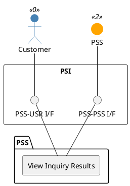

=begin

# TOD-03-01-03-View_Inquiry_Results

> The heading has to be included in the document including this document.

=end

{#fig:TOD-03-01-03-View_Inquiry_Results}

**Prerequisites**

The customer inquiry was processed and produced results.

**Main operation**

The customer wants to see the results of their inquiry.
These can be of different nature:

* The foundation of all results are product specifications that are within the boundaries of the inquired characteristics.
  When there is no more data, these may be used to initiate a RFQ or ITT to retrieve a product offering.
* Whenever possible, each product specification should be complemented with a product offering.
  This allows the customer to order the product immediately without a (possibly lengthy) RFQ process.
  If more than one offering for the same product is matching the inquiry (e.g. with different conditions), the provider system can either return them as multiple results with different priorities or in a single entry.
  The PSS must support both variants, but may split an entry depending on the subsequent processing needs.
  When there is no more data, the actual availability is unknown and may be checked via [TOD-05-04-01](#tod-05-04-01-check_product_stock).
* Lastly, the results can contain available product instances from the inventory.
  In this case, the PSS can show the availability and no further checks are necessary, which may result in higher ranking.
  Note that this does not imply a reservation, so the actual order may still be rejected if the resource was booked in the meantime.

In addition, the inquiry result can contain relationship definitions between a single result entity and an inquired product.
This is particularly necessary if the inquiry includes more than one inquired product and potentially results in multiple entities per inquiry result.
With the help of this approach a clear assignment is ensured between the inquired products and the results.
Furthermore, relationship-dependent details are provided in this way, such as the coverage (full or partial matches), a deviation of the service period or the calculated prices.

All of these can be fetched from the corresponding endpoint listed below.
It should be noted that different responses are used if there is no content because the inquiry was not processed or no entities were found.
If the inquiry is processed by an algorithm, the endpoints may optionally block for a few seconds to wait for results.
It is up to the implementation (or human decision) whether to include partial matches when there are others that fully match the target values.

**REST Endpoints**

@include [TOD-03-01-03 View Inquiry Results Endpoints](endpoints/TOD-03-01-03-View_Inquiry_Results-endpoints.md)

**Post Conditions**

The inquiry results are returned to be viewed.

**Applicable Requirements**

@include [TOD-03-01-03 View Inquiry Results Requirements](requirements/TOD-03-01-03-View_Inquiry_Results-requirements.md)

**eTOM Reference**

None
