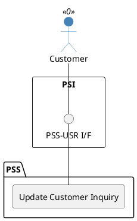

=begin

# TOD-03-01-04-Update_Customer_Inquiry

> The heading has to be included in the document including this document.

=end

{#fig:TOD-03-01-04-Update_Customer_Inquiry}

**Prerequisites**

The customer inquiry exists in the PSS datastore.

**Main operation**

Updates the inquired provider list of an existing customer inquiry via a standard interface specification.
The inquiry will be processed asynchronously, either via an algorithm or manually by a provider.
To do that, the PSS may forward the inquiry to eligible providers via Event Management API.
This includes

* sending inquiry cancellations to providers which are no longer part of the inquired providers list and
* initial sending of the inquiry to the providers newly added to the list of inquired providers.

Updates on a customer inquiry are restricted to the inquired providers list only, because any other change of the inquiry specification has to result in processing the inquiry again.
Therefore, if changes need to be made to the inquiry specification, the active inquiry can be cancelled and a new one with the new specifications can be initiated.
A PSS may support the customers in the definition process, e.g. by creating an inquiry based on a previously created one.

Details concerning the structure and processing of a customer inquiry are explained in [TOD-03-01-01](#tod-03-01-01-createcustomerinquiry).

**REST Endpoints**

@include [TOD-03-01-04 Update Customer Inquiry Endpoints](endpoints/TOD-03-01-04-Update_Customer_Inquiry-endpoints.md)

**Post Conditions**

* The customer inquiry is successfully updated in the PSS datastore.
* The processor of the inquiry is notified.

**Applicable Requirements**

@include [TOD-03-01-04 Update Customer Inquiry Requirements](requirements/TOD-03-01-04-Update_Customer_Inquiry-requirements.md)

**eTOM Reference**

The operation is based on 1.3.5.1 process identifiers from the eTOM.

