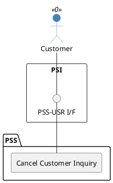

=begin

# TOD-03-01-05-Cancel_Customer_Inquiry

> The heading has to be included in the document including this document.

=end

{#fig:TOD-03-01-05-Cancel_Customer_Inquiry}

**Prerequisites**

The customer inquiry exists in the PSS datastore.

**Main operation**

Cancels an existing customer inquiry via a standard interface specification.
Due to the asynchronous processing, PSS forwards the cancellation state to eligible providers via the Event Management API.

**REST Endpoints**

@include [TOD-03-01-05 Cancel Customer Inquiry Endpoints](endpoints/TOD-03-01-05-Cancel_Customer_Inquiry-endpoints.md)

**Post Conditions**

* The customer inquiry is successfully marked as cancelled in the PSS datastore.
* The processor of the inquiry is notified.

**Applicable Requirements**

@include [TOD-03-01-05 Cancel Customer Inquiry Requirements](requirements/TOD-03-01-05-Cancel_Customer_Inquiry-requirements.md)

**eTOM Reference**

The operation is based on 1.3.5.1 process identifiers from the eTOM.

