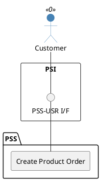

=begin

# TOD-03-02-01-Create_Product_Order

> The heading has to be included in the document including this document.

=end

{#fig:TOD-03-02-01-Create_Product_Order}

**Prerequisites**

The product order does not exist in the PSS datastore.

**Main operation**

The customer creates a new product order to the PSS via a standard interface specification.
The PSS then forwards the created order to the provider via Event Management API.
This can be done in different stages of the product lifecycle:

1. Initially, the customer creates an order based on a product specification and offering from the catalog or matchmaking.
  The order is eventually fulfilled (on interface level) by **creating** product, service and resource instances in the inventory.
  It is not modified afterwards but remains archived.
2. The customer can request to change an existing product instance by creating a new product order.
  This can usually be done based on the boundaries defined in the product specification, e.g. by increasing the information rate.
  The new order is fulfilled (on interface level) by **updating** or **deleting** the product, service and resource instances in the inventory.

Some properties of the product order are:

* *productOrderItem* - List of product order items containing:
  * *productOffering* - A reference to the ordered offering.
  * *itemPrice* - A list of (one-time and recurring) item prices.
    An amount, usually of money, that represents the actual price paid by the customer for the order item.
  * *action* - The action to be carried out on the product.
    Can be: add, modify, delete, noChange.
  * *product* - A reference to the product to be modified or deleted (if applicable).
  * *requestedStartDate*/*requestedEndDate* - The option for a start and end date deviating from the order.
  * *productOrderItemRelationship* - A list of relations on item level, to reflect bundles and other dependencies.
* *orderTotalPrice* - A list of the combined prices of the items.
* *relatedParty* - A list of related parties for the order (e.g. customer, PSS and provider).

**REST Endpoints**

@include [TOD-03-02-01 Create Product Order Endpoints](endpoints/TOD-03-02-01-Create_Product_Order-endpoints.md)

**Post Conditions**

The product is successfully created in the PSS datastore and later to the provider's datastore via the Event Management API.

**Applicable Requirements**

@include [TOD-03-02-01 Create Product Order Requirements](requirements/TOD-03-02-01-Create_Product_Order-requirements.md)

**eTOM Reference**

The operation is based on 1.3.3.5.2 process identifier from the eTOM.

