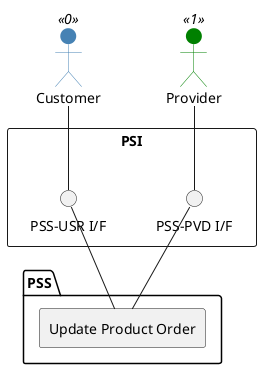

=begin

# TOD-03-02-02-Update_Product_Order

> The heading has to be included in the document including this document.

=end

{#fig:TOD-03-02-02-Update_Product_Order}

**Prerequisites**

The product order exists in the PSS and provider's datastore.

**Main operation**

The customer updates an existing product order in the PSS via a standard interface specification.
The PSS then forwards the update to the provider via the Event Management API.
A provider can also update a product order in the PSS.

This operation is possible only if the current state of the order allows the change.
It should not be possible to update orders that are `cancelled` or `completed`.

**REST Endpoints**

@include [TOD-03-02-02 Update Product Order Endpoints](endpoints/TOD-03-02-02-Update_Product_Order-endpoints.md)

**Post Conditions**

The product order is successfully updated in the PSS and provider datastores.

**Applicable Requirements**

@include [TOD-03-02-02 Update Product Order Requirements](requirements/TOD-03-02-02-Update_Product_Order-requirements.md)

**eTOM Reference**

The operation is based on 1.3.3.5.3 process identifier from the eTOM.

