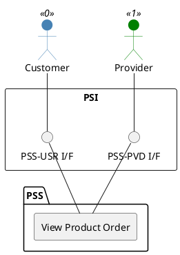

=begin

# TOD-03-02-03-View_Product_Order

> The heading has to be included in the document including this document.

=end

{#fig:TOD-03-02-03-View_Product_Order}

**Prerequisites**

The product order exists in the PSS datastore.

**Main operation**

Gets a product order with a specific identifier via a standard interface specification.
The customer and the provider can request to view the product order from the PSS.

**REST Endpoints**

@include [TOD-03-02-03 View Product Order Endpoints](endpoints/TOD-03-02-03-View_Product_Order-endpoints.md)

**Post Conditions**

The product order that the customer or provider can read, is successfully returned to be viewed.

**Applicable Requirements**

@include [TOD-03-02-03 View Product Order Requirements](requirements/TOD-03-02-03-View_Product_Order-requirements.md)

**eTOM Reference**

None
