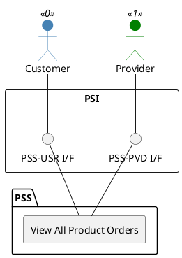

=begin

# TOD-03-02-04-View_All_Product_Orders

> The heading has to be included in the document including this document.

=end

{#fig:TOD-03-02-04-View_All_Product_Orders}

**Prerequisites**

Product orders exist in the PSS datastore.

**Main operation**

Gets all product orders of the customer from the PSS via a standard interface specification.
The provider can also request to view all of their product orders from the PSS.

**REST Endpoints**

@include [TOD-03-02-04 View All Product Orders Endpoints](endpoints/TOD-03-02-04-View_All_Product_Orders-endpoints.md)

**Post Conditions**

All product orders which the customer or provider can read are successfully returned to be viewed.

**Applicable Requirements**

@include [TOD-03-02-04 View All Product Orders Requirements](requirements/TOD-03-02-04-View_All_Product_Orders-requirements.md)

**eTOM Reference**

None
