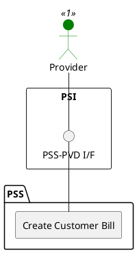

=begin

# TOD-03-03-01-Create_Customer_Bill

> The heading has to be included in the document including this document.

=end

{#fig:TOD-03-03-01-Create_Customer_Bill}

**Prerequisites**

The customer bill does not exist in the PSS datastore.

**Main operation**

The provider creates a new customer bill to the PSS via a standard interface specification.

Some properties of the customer bill are:

* *billNo* - The bill number as a customer reference which is displayed on the bill.
* *billDocument* - A list of attachments comprising the bill.
* *amountDue* - The amount to be paid in a given currency.
* *paymentDueDate* - The date at which the amount due should have been paid.
* *state* - The status of the bill (e.g. 'validated', 'sent', 'settled', 'partiallyPaid').
* *billingAccount (optional)* - A reference to the account that is charged for the bill. It can also include the payment method.
* *appliedPayments (optional)* - A list of applied payments associated with the bill.
  
**REST Endpoints**

@include [TOD-03-03-01 Create Customer Bill Endpoints](endpoints/TOD-03-03-01-Create_Customer_Bill-endpoints.md)

**Post Conditions**

The customer bill is successfully created in the PSS.

**Applicable Requirements**

@include [TOD-03-03-01 Create Customer Bill Requirements](requirements/TOD-03-03-01-Create_Customer_Bill-requirements.md)

**eTOM Reference**

The operation is based on 1.3.9.2 process identifier from the eTOM.

