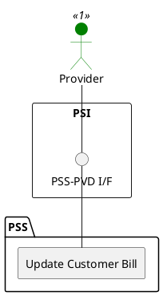

=begin

# TOD-03-03-02-Update_Customer_Bill

> The heading has to be included in the document including this document.

=end

{#fig:TOD-03-03-02-Update_Customer_Bill}

**Prerequisites**

The customer bill exists in the PSS datastore.

**Main operation**

The provider updates the state of an existing customer bill in the PSS via a standard interface specification.
It should not be possible to update the customer bill's properties that affect its traceability for tax reasons.

**REST Endpoints**

@include [TOD-03-03-02 Update Customer Bill Endpoints](endpoints/TOD-03-03-02-Update_Customer_Bill-endpoints.md)

**Post Conditions**

The customer bill is successfully updated in the PSS.

**Applicable Requirements**

@include [TOD-03-03-02 Update Customer Bill Requirements](requirements/TOD-03-03-02-Update_Customer_Bill-requirements.md)

**eTOM Reference**

The operation is based on 1.3.9.4.3 process identifier from the eTOM.

