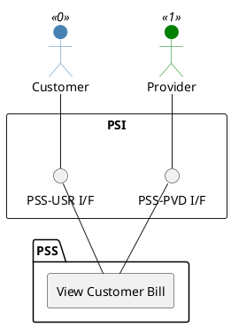

=begin

# TOD-03-03-03-View_Customer_Bill

> The heading has to be included in the document including this document.

=end

{#fig:TOD-03-03-03-View_Customer_Bill}

**Prerequisites**

The customer bill exists in the PSS datastore.

**Main operation**

Gets a customer bill with a specific identifier via a standard interface specification.

**REST Endpoints**

@include [TOD-03-03-03 View Customer Bill Endpoints](endpoints/TOD-03-03-03-View_Customer_Bill-endpoints.md)

**Post Conditions**

The customer bill that the customer or the provider can read, is successfully returned to be viewed.

**Applicable Requirements**

@include [TOD-03-03-03 View Customer Bill Requirements](requirements/TOD-03-03-03-View_Customer_Bill-requirements.md)

**eTOM Reference**

The operation is based on 1.3.9.2.2 process identifier from the eTOM.

