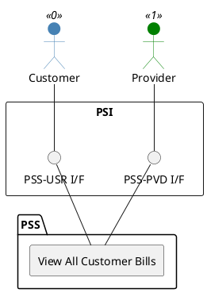

=begin

# TOD-03-03-04-View_All_Customer_Bills

> The heading has to be included in the document including this document.

=end

{#fig:TOD-03-03-04-View_All_Customer_Bills}

**Prerequisites**

Customer bills exist in the PSS datastore.

**Main operation**

Gets all customer bills from the PSS via a standard interface specification.
Filtering based at least on the state and the bill number can be applied in addition.

**REST Endpoints**

@include [TOD-03-03-04 View All Customer Bills Endpoints](endpoints/TOD-03-03-04-View_All_Customer_Bills-endpoints.md)

**Post Conditions**

All (filtered) customer bills which the customer or the provider can read are successfully returned to be viewed.

**Applicable Requirements**

@include [TOD-03-03-04 View All Customer Bills Requirements](requirements/TOD-03-03-04-View_All_Customer_Bills-requirements.md)

**eTOM Reference**

The operation is based on 1.3.9.2.2 process identifier from the eTOM.

