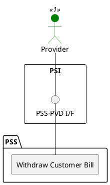

=begin

# TOD-03-03-05-Withdraw_Customer_Bill

> The heading has to be included in the document including this document.

=end

{#fig:TOD-03-03-02-Withdraw_Customer_Bill}

**Prerequisites**

The customer bill exists in the PSS datastore.

**Main operation**

The provider withdraws an existing customer bill in the PSS.

**REST Endpoints**

@include [TOD-03-03-05 Withdraw Customer Bill Endpoints](endpoints/TOD-03-03-05-Withdraw_Customer_Bill-endpoints.md)

**Post Conditions**

The customer bill is successfully set to the state *widtdrawn* in the PSS.

**Applicable Requirements**

@include [TOD-03-03-05 Withdraw Customer Bill Requirements](requirements/TOD-03-03-05-Withdraw_Customer_Bill-requirements.md)

**eTOM Reference**

None
