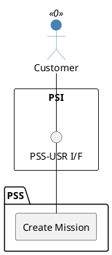

=begin

# TOD-03-04-01-Create_Mission

> The heading has to be included in the document including this document.

=end

{#fig:TOD-03-04-01-Create_Mission}

**Prerequisites**

The mission does not exist in the PSS datastore.

**Main operation**

Creates a new mission via a standard interface specification.

Some properties of a mission are:

* *name* - Short name of the target offering
* *description* - Description of the target offering
* *timeframe* - Start and end time of the mission
* *characteristic* - Additional properties as defined by the PSS (e.g. default values for assets)
* *place* - List of places where the mission is conducted
* *asset* - List of assets that are required for the mission, potentially linked to one or more
  * places
  * pre-owned resources/services
  * ordered products
  * related assets, e.g. required hardware for a service

Utilization periods of assets may be planned in various combinations, depending on the state of planning:

* Templates may include purely relative times (e.g. "one week after mission start"), which shall be translated to absolute times when the corresponding anchor is known.
* The implementation may choose to retain the offset to adjust the absolute time when the anchor is changed, and only delete it when the user opts to detach the times.

Note that teams may be expressed as **resources** and therefore may be managed as **assets** as well.
This requires corresponding resource specifications (e.g. of a profession) in the catalog.

**REST Endpoints**

@include [TOD-03-04-01 Create Mission Endpoints](endpoints/TOD-03-04-01-Create_Mission-endpoints.md)

**Post Conditions**

The mission is successfully created in the PSS datastore.

**Applicable Requirements**

@include [TOD-03-04-01 Create Mission Requirements](requirements/TOD-03-04-01-Create_Mission-requirements.md)

**eTOM Reference**

The operation is not based on the eTOM.
