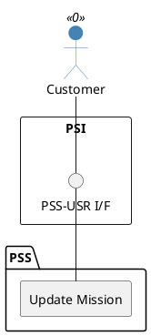

=begin

# TOD-03-04-02-Update_Mission

> The heading has to be included in the document including this document.

=end

{#fig:TOD-03-04-02-Update_Mission}

**Prerequisites**

The mission exists in the PSS datastore.

**Main operation**

Updates an existing mission via a standard interface specification.
This may be done explicitly by the customer because of changes in places or requirements, but also by another subsystem that automatically assigns products, services or resources because of an order.

**REST Endpoints**

@include [TOD-03-04-02 Update Mission Endpoints](endpoints/TOD-03-04-02-Update_Mission-endpoints.md)

**Post Conditions**

The mission is successfully updated in the PSS datastore.

**Applicable Requirements**

@include [TOD-03-04-02 Update Mission Requirements](requirements/TOD-03-04-02-Update_Mission-requirements.md)

**eTOM Reference**

The operation is not based on the eTOM.
