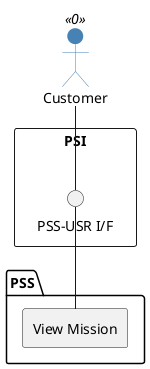

=begin

# TOD-03-04-04-View_Mission

> The heading has to be included in the document including this document.

=end

{#fig:TOD-03-04-04-View_Mission}

**Prerequisites**

The mission exists in the PSS datastore.

**Main operation**

Gets a mission of the provider with a specific identifier via a standard interface specification.

**REST Endpoints**

@include [TOD-03-04-04 View Mission Endpoints](endpoints/TOD-03-04-04-View_Mission-endpoints.md)

**Post Conditions**

The mission is successfully returned to be viewed.

**Applicable Requirements**

@include [TOD-03-04-04 View Mission Requirements](requirements/TOD-03-04-04-View_Mission-requirements.md)

**eTOM Reference**

The operation is not based on the eTOM.
