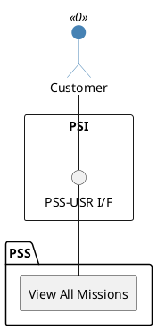

=begin

# TOD-03-04-05-View_All_Missions

> The heading has to be included in the document including this document.

=end

{#fig:TOD-03-04-05-View_All_Missions}

**Prerequisites**

Missions of the customer exist in the PSS datastore.

**Main operation**

Gets all missions of the customer via a standard interface specification.

**REST Endpoints**

@include [TOD-03-04-05 View All Missions Endpoints](endpoints/TOD-03-04-05-View_All_Missions-endpoints.md)

**Post Conditions**

All missions of the customer are successfully returned to be viewed.

**Applicable Requirements**

@include [TOD-03-04-05 View All Missions Requirements](requirements/TOD-03-04-05-View_All_Missions-requirements.md)

**eTOM Reference**

The operation is not based on the eTOM.
