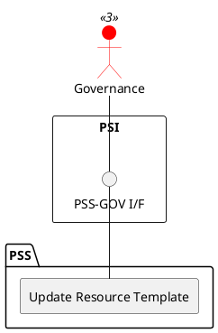

=begin

# TOD-04-01-02-Update_Resource_Template

> The heading has to be included in the document including this document.

=end

{#fig:TOD-04-01-02-Update_Resource_Template}

**Prerequisites**

The resource template exists in the PSS datastore.

**Main operation**

Updates an existing resource template via a standard interface specification available to the governance only.

**REST Endpoints**

@include [TOD-04-01-02 Update Resource Template Endpoints](endpoints/TOD-04-01-02-Update_Resource_Template-endpoints.md)

**Post Conditions**

The resource template is successfully updated in the PSS datastore.

**Applicable Requirements**

@include [TOD-04-01-02 Update Resource Template Requirements](requirements/TOD-04-01-02-Update_Resource_Template-requirements.md)

**eTOM Reference**

None
