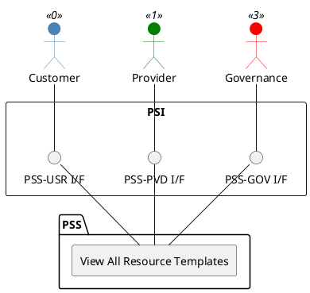

=begin

# TOD-04-01-05-View_All_Resource_Templates

> The heading has to be included in the document including this document.

=end

{#fig:TOD-04-01-05-View_All_Resource_Templates}

**Prerequisites**

Resource templates exist in the PSS datastore.

**Main operation**

Gets all resource templates via a standard interface specification.
These can be filtered by name and resource type.

**REST Endpoints**

@include [TOD-04-01-05 View All Resource Templates Endpoints](endpoints/TOD-04-01-05-View_All_Resource_Templates-endpoints.md)

**Post Conditions**

All resource templates matching the filter criteria are successfully returned to be viewed.

**Applicable Requirements**

@include [TOD-04-01-05 View All Resource Templates Requirements](requirements/TOD-04-01-05-View_All_Resource_Templates-requirements.md)

**eTOM Reference**

None
