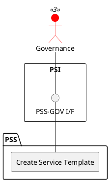

=begin

# TOD-04-02-01-Create_Service_Template

> The heading has to be included in the document including this document.

=end

{#fig:TOD-04-02-01-Create_Service_Template}

**Prerequisites**

The service template does not exist in the PSS datastore.

**Main operation**

The governance creates a new service template in the PSS with predefined field values for a service specification of a given service type (e.g. internet access, telephony).
The service template can then be used by providers to register a service specification by replacing the default values in the template with their service specific values.

**REST Endpoints**

@include [TOD-04-02-01 Create Service Template Endpoints](endpoints/TOD-04-02-01-Create_Service_Template-endpoints.md)

**Post Conditions**

The service template is successfully created in the PSS datastore.

**Applicable Requirements**

@include [TOD-04-02-01 Create Service Template Requirements](requirements/TOD-04-02-01-Create_Service_Template-requirements.md)

**eTOM Reference**

None
