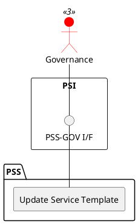

=begin

# TOD-04-02-02-Update_Service_Template

> The heading has to be included in the document including this document.

=end

{#fig:TOD-04-02-02-Update_Service_Template}

**Prerequisites**

The service template exists in the PSS datastore.

**Main operation**

Updates an existing service template via a standard interface specification available to the governance only.

**REST Endpoints**

@include [TOD-04-02-02 Update Service Template Endpoints](endpoints/TOD-04-02-02-Update_Service_Template-endpoints.md)

**Post Conditions**

The service template is successfully updated in the PSS datastore.

**Applicable Requirements**

@include [TOD-04-02-02 Update Service Template Requirements](requirements/TOD-04-02-02-Update_Service_Template-requirements.md)

**eTOM Reference**

None
