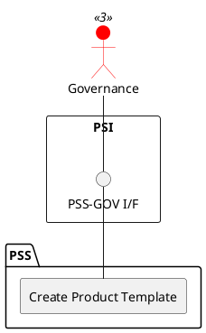

=begin

# TOD-04-03-01-Create_Product_Template

> The heading has to be included in the document including this document.

=end

{#fig:TOD-04-03-01-Create_Product_Template}

**Prerequisites**

The product template does not exist in the PSS datastore.

**Main operation**

The governance creates a new product template in the PSS with predefined field values for a product specification of a given product type (e.g. internet access, telephony, terminal).
The product template can then be used by providers to register a product specification by replacing the default values in the template with their product specific values.

**REST Endpoints**

@include [TOD-04-03-01 Create Product Template Endpoints](endpoints/TOD-04-03-01-Create_Product_Template-endpoints.md)

**Post Conditions**

The product template is successfully created in the PSS datastore.

**Applicable Requirements**

@include [TOD-04-03-01 Create Product Template Requirements](requirements/TOD-04-03-01-Create_Product_Template-requirements.md)

**eTOM Reference**

None
