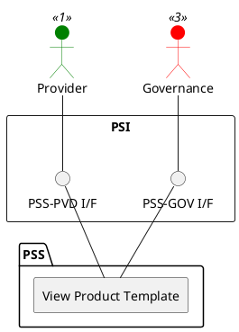

=begin

# TOD-04-03-04-View_Product_Template

> The heading has to be included in the document including this document.

=end

{#fig:TOD-04-03-04-View_Product_Template}

**Prerequisites**

The product template exists in the PSS datastore.

**Main operation**

Gets a product template with a specific identifier via a standard interface specification.

**REST Endpoints**

@include [TOD-04-03-04 View Product Template Endpoints](endpoints/TOD-04-03-04-View_Product_Template-endpoints.md)

**Post Conditions**

The product template is successfully returned to be viewed.

**Applicable Requirements**

@include [TOD-04-03-04 View Product Template Requirements](requirements/TOD-04-03-04-View_Product_Template-requirements.md)

**eTOM Reference**

None
