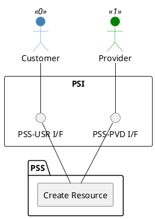

=begin

# TOD-05-01-01-Create_Resource

> The heading has to be included in the document including this document.

=end

{#fig:TOD-05-01-01-Create_Resource}

**Prerequisites**

The resource does not exist in the PSS datastore.

**Main operation**

Creates a new resource instance with its characteristics via a standard interface based on a specification.

Some properties of a resource are:

* *name* - Short name of the target resource
* *description* - Description of the target resource
* *category* - Category (resource type) of the target resource like terminals, bandwidth, etc.
* *resourceSpecification* - The specification this resource is based on
* *resourceStatus* - The status of the resources (e.g. available or reserved)
* *type*/*schemaLocation* - Name and reference to the JSON Schema defining the type of this resource.
* *resourceCharacteristic* - List of characteristics i.e. technicals of the resource such as frequency band, Tx/Rx frequency, etc.
* *relatedParty* - References to the provider owning the resource and the customer that booked it (if applicable)
* *startOperatingDate* / *endOperatingDate* - Operational time period of the resource

**REST Endpoints**

@include [TOD-05-01-01 Create Resource Endpoints](endpoints/TOD-05-01-01-Create_Resource-endpoints.md)

**Post Conditions**

The resource is successfully created in the PSS datastore.

**Applicable Requirements**

@include [TOD-05-01-01 Create Resource Requirements](requirements/TOD-05-01-01-Create_Resource-requirements.md)

**eTOM Reference**

The operation is based on the 1.5.4.5.1 process identifier from the eTOM.
