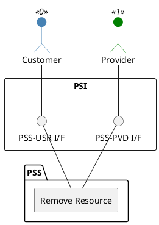

=begin

# TOD-05-01-03-Remove_Resource

=end

{#fig:TOD-05-01-03-Remove_Resource}

**Prerequisites**

The resource exists in the PSS datastore.

**Main operation**

Removes a resource either by deleting it or indicating it is no longer valid, via a standard interface.

**REST Endpoints**

@include [TOD-05-01-03 Remove Resource Endpoints](endpoints/TOD-05-01-03-Remove_Resource-endpoints.md)

**Post Conditions**

The resource is successfully deleted or indicated it is no longer valid in the PSS datastore.

**Applicable Requirements**

@include [TOD-05-01-03 Remove Resource Requirements](requirements/TOD-05-01-03-Remove_Resource-requirements.md)

**eTOM Reference**

The operation is based on the 1.5.4.5.1 process identifier from the eTOM.
