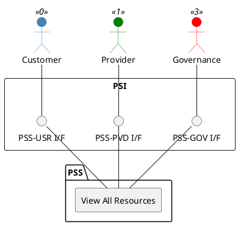

=begin

# TOD-05-01-05-View_All_Resources

> The heading has to be included in the document including this document.

=end

{#fig:TOD-05-01-05-View_All_Resources}

**Prerequisites**

Resources exist in the PSS datastore.

**Main operation**

Gets all visible resources previously registered in the PSS via a standard interface.
These can be filtered at least by resource type.
Customers can view their own declared resources and those they booked.

**REST Endpoints**

@include [TOD-05-01-05 View All Resources Endpoints](endpoints/TOD-05-01-05-View_All_Resources-endpoints.md)

**Post Conditions**

All visible resources are successfully returned to be viewed.

**Applicable Requirements**

@include [TOD-05-01-05 View All Resources Requirements](requirements/TOD-05-01-05-View_All_Resources-requirements.md)

**eTOM Reference**

The operation is based on the 1.5.4.5 process identifier from the eTOM.
