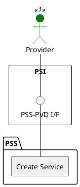

=begin

# TOD-05-02-01-Create_Service

> The heading has to be included in the document including this document.

=end

{#fig:TOD-05-02-01-Create_Service}

**Prerequisites**

The service does not exist in the PSS datastore.

**Main operation**

Creates a new service instance with its characteristics and references to resources via a standard interface based on a specification.

Some properties of a service are:

* *name* - Short name of the target service
* *description* - Description of the target service
* *category* - Category (service type) of the target service like internet access, telephony, IP-Trunk, etc.
* *supportingResource* - List of resources that are required to realise the target service
* *type*/*schemaLocation* - Name and reference to the JSON Schema defining the type of this service.
* *serviceCharacteristic* - List of characteristics of the target service such as forwardCIR, returnCIR, etc.
* *relatedParty* - References to the provider owning the resource and the customer that booked it
* *state* - Current status of the service (e.g. inactive, active, terminated, etc.)
* *startDate* / *endDate* - Time period of validity of the service

**REST Endpoints**

@include [TOD-05-02-01 Create Service Endpoints](endpoints/TOD-05-02-01-Create_Service-endpoints.md)

**Post Conditions**

The service is successfully created in the PSS datastore.

**Applicable Requirements**

@include [TOD-05-02-01 Create Service Requirements](requirements/TOD-05-02-01-Create_Service-requirements.md)

**eTOM Reference**

The operation is based on the 1.4.4.1 process identifier from the eTOM.
