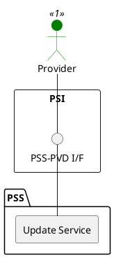

=begin

# TOD-05-02-02-Update_Service

> The heading has to be included in the document including this document.

=end

{#fig:TOD-05-02-02-Update_Service}

**Prerequisites**

The service exists in the PSS datastore.

**Main operation**

Updates an existing service via a standard interface.

**REST Endpoints**

@include [TOD-05-02-02 Update Service Endpoints](endpoints/TOD-05-02-02-Update_Service-endpoints.md)

**Post Conditions**

The service is successfully updated in the PSS datastore.

**Applicable Requirements**

@include [TOD-05-02-02 Update Service Requirements](requirements/TOD-05-02-02-Update_Service-requirements.md)

**eTOM Reference**

The operation is based on the 1.4.4.1 process identifier from the eTOM.
