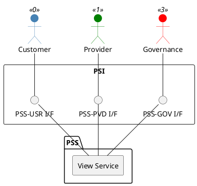

=begin

# TOD-05-02-04-View_Service

> The heading has to be included in the document including this document.

=end

{#fig:TOD-05-02-04-View_Service}

**Prerequisites**

The service exists in the PSS datastore.

**Main operation**

Gets a service with a specific identifier via a standard interface.
Customers can only see the services they booked.

**REST Endpoints**

@include [TOD-05-02-04 View Service Endpoints](endpoints/TOD-05-02-04-View_Service-endpoints.md)

**Post Conditions**

The service is successfully returned to be viewed.

**Applicable Requirements**

@include [TOD-05-02-04 View Service Requirements](requirements/TOD-05-02-04-View_Service-requirements.md)

**eTOM Reference**

The operation is based on the 1.4.4.1 process identifier from the eTOM.
