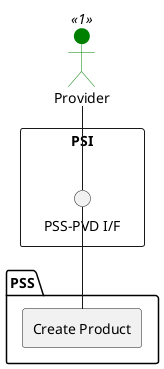

=begin

# TOD-05-03-01-Create_Product

> The heading has to be included in the document including this document.

=end

{#fig:TOD-05-03-01-Create_Product}

**Prerequisites**

The product does not exist in the PSS datastore.

**Main operation**

Creates a new product with its characteristics and references to resource/services via a standard interface.

> Note: It is possible to create a product which will be available in the future by setting the *startDate* property with a future time reference.

Some properties of a product are:

* *name* - Short name of the target product
* *description* - Description of the target product
* *product* - If the product is a bundle of multiple products, a list of the related products
* *realizingResource* - List of resources that are required to realise the target product
* *realizingService* - List of services that are required to realise the target product
* *type*/*schemaLocation* - Name and reference to the JSON Schema defining the type of this product.
* *productCharacteristic* - List of distinctive features of the target product such as 'networkUptime', 'dataAllowance', etc.
* *relatedParty* - References to the provider that sold the product and the customer that booked it
* *status* - Current lifecycle status of the product (e.g. created, active, terminated, etc.)
* *startDate* / *terminationDate* - Time period of validity of the product

**REST Endpoints**

@include [TOD-05-03-01 Create Product Endpoints](endpoints/TOD-05-03-01-Create_Product-endpoints.md)

**Post Conditions**

The product is successfully created in the PSS datastore.

**Applicable Requirements**

@include [TOD-05-03-01 Create Product Requirements](requirements/TOD-05-03-01-Create_Product-requirements.md)

**eTOM Reference**

The operation is based on the 1.2.11 process identifier from the eTOM.
